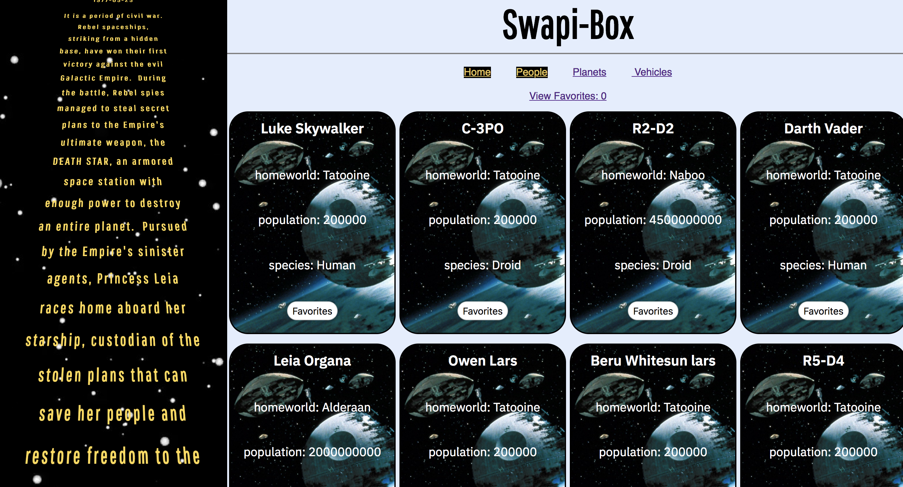

# Swapi-Box

Swapi-Box is a react app that allows the users to view StarWars Data. It uses the Star Wars API. This was an individual project designed to challenge ourselves in building react, making API calls, cleaning data and TDD.

## Project Goals

The goal of this project is to built muscle memory by building out react components and well as familiarize ourselves with API calls. The data gotten back had to be cleaned before use. Another goal is to thoroughly test out the application using Jest and Enzyme.

## Set Up

Clone this repository

Run `npm install` from the root directory

run `npm start` and visit localhost:3000 in your browser

## Screenshot

